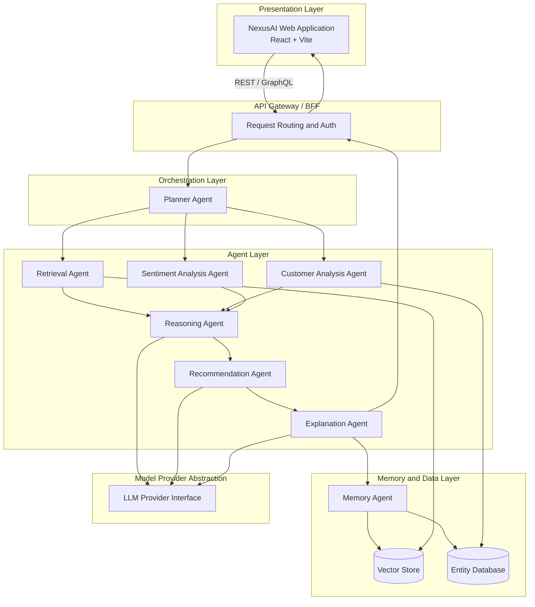
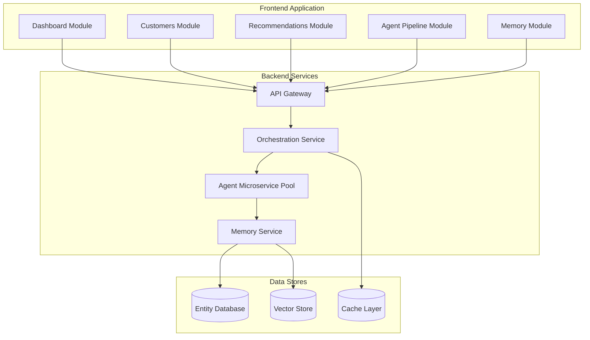
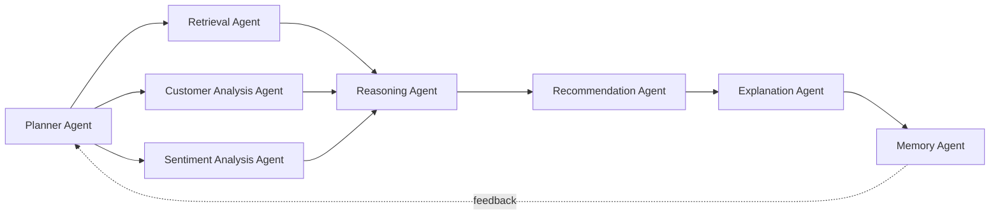
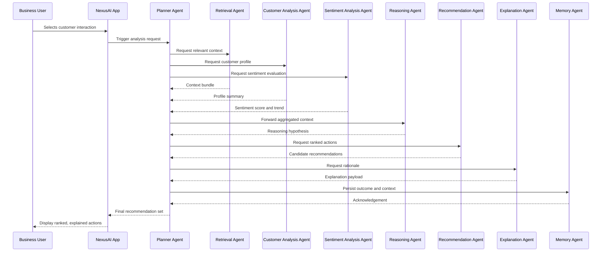

# NexusAI
## Solution Architecture Document
### Intelligent Next Best Action Platform — Agentic AI Decision Intelligence System

**Document Type:** Software Architecture Document (SAD)
**Prepared For:** Intelligent Next Best Action Platform Hackathon — Judges & Reviewers
**Repository:** https://github.com/Saranyavellanki/NexusAI
**Version:** 1.0

---

## Table of Contents

1. [Executive Summary](#1-executive-summary)
2. [Project Objectives](#2-project-objectives)
3. [Business Problem](#3-business-problem)
4. [Solution Overview](#4-solution-overview)
5. [System Architecture](#5-system-architecture)
6. [High-Level Architecture Diagram](#6-high-level-architecture-diagram)
7. [Component Architecture](#7-component-architecture)
8. [Agent Architecture](#8-agent-architecture)
9. [End-to-End Workflow](#9-end-to-end-workflow)
10. [Data Flow](#10-data-flow)
11. [Module Descriptions](#11-module-descriptions)
12. [Technology Stack](#12-technology-stack)
13. [Development Tools](#13-development-tools)
14. [Design Decisions](#14-design-decisions)
15. [Scalability and Extensibility](#15-scalability-and-extensibility)
16. [Security Considerations](#16-security-considerations)
17. [Future Enhancements](#17-future-enhancements)
18. [Conclusion](#18-conclusion)

---

## 1. Executive Summary

NexusAI is an Agentic AI decision-intelligence platform engineered to convert customer interaction data into explainable, ranked next-best-action recommendations for business users. Rather than relying on a single monolithic model call, NexusAI is architected around a coordinated multi-agent system in which specialized agents handle distinct cognitive tasks — planning, retrieval, customer profiling, sentiment interpretation, reasoning, recommendation synthesis, explanation generation, and long-term memory — and exchange context with one another through a central orchestration layer.

The platform's design objective is to give business stakeholders more than a single output score: a transparent, auditable trail of how the system reasoned its way to a recommendation. This addresses one of the central adoption barriers for AI in revenue and customer-success organizations — trust in automated decisions.

The current release of NexusAI realizes the platform's interaction layer: a responsive React/Vite application exposing the five core operational surfaces of the platform — **Dashboard, Customers, Recommendations, Agent Pipeline,** and **Memory** — designed to operate against the orchestration and agent services specified throughout this document. This document defines the complete target architecture of NexusAI: the agent topology, the control and data flow between agents, the technology stack, and the engineering and security decisions that support a production-grade rollout of an agentic decision-intelligence system inside an enterprise CRM, support, or customer-engagement environment.

---

## 2. Project Objectives

NexusAI is designed to achieve the following architectural and business objectives:

| # | Objective | Description |
|---|-----------|--------------|
| 1 | Evidence-grounded recommendations | Generate next-best-action guidance backed by retrieved context rather than static, rule-based scoring. |
| 2 | Agent-decomposed reasoning | Resolve each decision through specialized agents rather than a single, opaque inference step. |
| 3 | Explainability by design | Pair every recommendation with a human-readable rationale that cites the evidence used to produce it. |
| 4 | Persistent institutional memory | Maintain a long-term memory layer so the platform can learn from prior recommendation outcomes. |
| 5 | Operational transparency | Provide a real-time, visual Agent Pipeline so technical and business stakeholders can inspect agent execution. |
| 6 | Extensible agent framework | Allow new specialized agents to be registered without re-architecting the orchestration layer. |
| 7 | Platform interoperability | Establish a foundation that can integrate with CRM, support, marketing, and communication systems. |

---

## 3. Business Problem

Customer-facing teams — sales, support, success, and marketing — must routinely decide, in the moment, the most effective next action for a given customer: offering a discount, escalating to a human specialist, recommending an upsell, sending a retention message, or simply waiting. Several structural issues affect how organizations currently approach this decision:

- **Fragmented context.** CRM notes, support tickets, emails, and call transcripts live in disconnected systems, so the full picture of a customer relationship is rarely visible at the point of decision.
- **Inconsistent decision quality.** Outcomes vary heavily based on individual representative experience, workload, and intuition.
- **Opaque automation.** Conventional recommendation engines surface a single score with no rationale, which erodes trust and suppresses adoption among frontline teams.
- **No institutional memory.** Organizations rarely retain a structured record of which recommendations worked, so the same mistakes recur across teams and over time.
- **Sentiment is under-utilized.** Tone and emotional trajectory are leading indicators of churn or upsell readiness, yet they are seldom incorporated into decisioning workflows in a systematic way.

NexusAI is designed to resolve these issues by providing a decision-support layer that is simultaneously **data-grounded** and **explainable** — the two properties required for sustained adoption of AI-driven recommendations in customer-facing workflows.

---

## 4. Solution Overview

NexusAI is structured as a layered, agent-orchestrated platform composed of four primary tiers:

| Layer | Responsibility | Representative Technologies |
|-------|------------------|------------------------------|
| **Presentation Layer** | Operator-facing web application exposing the Dashboard, Customers, Recommendations, Agent Pipeline, and Memory modules. | React, Vite, Tailwind CSS, shadcn/ui, Lucide React |
| **Orchestration Layer** | Coordinates the agent pipeline: decomposes each request, dispatches subtasks, and aggregates results through the Planner Agent. | Orchestration service, message/task queue, API Gateway |
| **Agent Layer** | Domain-specialized agents that retrieve context, analyze the customer and their sentiment, reason over evidence, and produce recommendations and explanations. | Agent microservices, LLM provider abstraction, RAG pipeline |
| **Memory & Data Layer** | Persists customer entities, interaction history, contextual embeddings, and recommendation outcomes for long-term learning. | Entity database, vector store, cache/session store |

This layered separation allows each tier to evolve independently: the presentation layer can be restyled or extended with new modules without altering agent logic; agents can be added, replaced, or fine-tuned without changing the frontend contract; and the memory layer can be swapped from a single-tenant store to a distributed, multi-tenant data platform as adoption scales.

---

## 5. System Architecture

NexusAI follows an **orchestrator–worker multi-agent architecture**, a deliberate alternative to two other common patterns:

- **Single monolithic prompt** — one large LLM call responsible for retrieval, reasoning, and output generation. Rejected because it collapses explainability (no intermediate state to inspect) and makes targeted improvement of a single capability — e.g., sentiment detection — impossible without retraining or re-prompting the entire pipeline.
- **Fully decentralized agent mesh** — agents communicate peer-to-peer with no central coordinator. Rejected for this platform because it sacrifices determinism and auditability, both of which are first-class requirements for a business-decision system that must be explainable to compliance and operations stakeholders.

The chosen orchestrator–worker pattern designates the **Planner Agent** as the single coordination point. The Planner decomposes each incoming request into subtasks, dispatches them to the appropriate specialized agents (in parallel where subtasks are independent, and sequentially where one agent's output is another's input), and aggregates the results into a single, traceable execution record. This record is the backbone of the Agent Pipeline module and the basis for the platform's explainability guarantees.

**Architectural style summary:**

- **Pattern:** Orchestrator–worker multi-agent system with a central Planner Agent
- **Integration style:** API Gateway / Backend-for-Frontend (BFF) fronting an internal agent service mesh
- **Model access:** Abstracted through a pluggable LLM Provider Interface, decoupling agent logic from any single model vendor
- **State management:** Stateless agent services backed by a persistent Memory & Data Layer for durability and learning
- **Communication:** Synchronous request/response between the UI and the Gateway; orchestrated, traceable agent-to-agent calls coordinated by the Planner

---

## 6. High-Level Architecture Diagram

The diagram below presents the platform's complete layered architecture — from the operator-facing application through orchestration, the agent layer, the model provider abstraction, and the memory and data layer.

**Reading the diagram:** the web application never communicates with agents directly; every request is routed through the API Gateway to the Planner Agent, which owns the full lifecycle of a recommendation request. The Model Provider Abstraction sits beside the agent layer rather than inside it, reflecting that any agent requiring generative or embedding capability calls into the same pluggable interface rather than binding directly to a model vendor's SDK.

---

## 7. Component Architecture

NexusAI's components are grouped into three deployable tiers: the frontend application, backend services, and data stores.

### Component Responsibilities

| Component | Responsibility |
|-----------|------------------|
| **API Gateway** | Single entry point for all frontend traffic; handles authentication, request routing, and rate limiting. |
| **Orchestration Service (Planner Agent)** | Decomposes incoming requests, schedules agent execution, and aggregates results into a single response. |
| **Agent Microservice Pool** | Hosts the Retrieval, Customer Analysis, Sentiment Analysis, Reasoning, Recommendation, and Explanation agents as independently deployable services. |
| **Memory Service** | Provides durable read/write access to the Entity Database and Vector Store, and exposes a context-recall API used by the Planner and other agents. |
| **LLM Provider Interface** | Abstracts model invocation (completion, chat, and embedding calls) behind a single internal contract, decoupling agents from any one model vendor. |
| **Entity Database** | Stores structured business entities — customers, interactions, recommendation outcomes. |
| **Vector Store** | Stores embeddings used for similarity search over historical interactions and knowledge base content (the retrieval substrate for RAG). |
| **Cache / Session Store** | Holds low-latency pipeline state, in-flight execution status, and session-scoped data for the Agent Pipeline view. |

---

## 8. Agent Architecture

NexusAI's intelligence is decomposed into eight cooperating agents, each owning a narrow, well-defined responsibility. This decomposition is what allows the platform to be both explainable (each agent's contribution can be inspected independently) and extensible (a new agent can be introduced into the pipeline without modifying existing agents).

### Agent Summary

| Agent | Primary Responsibility | Key Inputs | Key Outputs |
|-------|--------------------------|------------|--------------|
| Planner Agent | Orchestrates the end-to-end pipeline | Incoming interaction trigger | Execution plan, aggregated result |
| Retrieval Agent | Sources relevant context via RAG | Query, customer ID | Context bundle (documents, prior interactions) |
| Customer Analysis Agent | Builds the customer's business profile | Customer record, interaction history | Segment, lifecycle stage, value tier, risk indicators |
| Sentiment Analysis Agent | Assesses emotional tone and trend | Interaction text/transcript | Sentiment score, polarity trend, urgency flag |
| Reasoning Agent | Synthesizes a causal hypothesis | Context, profile, sentiment | Reasoning hypothesis, decision rationale |
| Recommendation Agent | Generates ranked candidate actions | Reasoning hypothesis | Ranked actions with confidence scores |
| Explanation Agent | Produces human-readable justification | Recommendations, supporting evidence | Explanation payload (citations, rationale) |
| Memory Agent | Persists context and outcomes | Final result, user feedback | Updated entity/vector records |

### 8.1 Planner Agent

The Planner Agent is the orchestration root of the pipeline. On receiving a triggering event — a business user opening a customer record, or a new interaction being logged — the Planner:

1. Decomposes the request into the subtasks required to produce a recommendation (context retrieval, profiling, sentiment scoring).
2. Dispatches independent subtasks concurrently to minimize end-to-end latency.
3. Sequences dependent subtasks (reasoning depends on retrieval, profiling, and sentiment all completing first).
4. Aggregates intermediate agent outputs into a unified context object passed down the pipeline.
5. Owns the execution record consumed by the Agent Pipeline module for real-time visualization.

### 8.2 Retrieval Agent

The Retrieval Agent implements the platform's Retrieval-Augmented Generation (RAG) capability. It queries the Vector Store for semantically similar historical interactions, relevant knowledge base articles, and applicable business policies, then returns a ranked, deduplicated context bundle. This agent is the platform's primary defense against hallucinated recommendations: every downstream agent reasons over retrieved evidence rather than relying solely on model-internal knowledge.

### 8.3 Customer Analysis Agent

The Customer Analysis Agent constructs and maintains a structured profile of the customer under review — segment, lifecycle stage (onboarding, active, at-risk, churned), historical value, product usage patterns, and churn-risk indicators. This profile is derived from the Entity Database and enriched with any newly retrieved context, giving the Reasoning Agent a stable, structured view of "who this customer is" independent of the current interaction's tone.

### 8.4 Sentiment Analysis Agent

The Sentiment Analysis Agent evaluates the emotional tone and trajectory of the current and recent interactions. It produces a sentiment score, a directional trend (improving, stable, deteriorating), and an urgency flag used to prioritize time-sensitive cases. Sentiment is treated as a first-class signal rather than a secondary annotation, reflecting its role as a leading indicator of churn and upsell readiness.

### 8.5 Reasoning Agent

The Reasoning Agent is the platform's synthesis point. It combines the retrieved context, the customer profile, and the sentiment evaluation into a single causal hypothesis about the customer's underlying need or state — for example, "this customer is price-sensitive and showing early frustration with onboarding friction." This hypothesis is produced through structured, chain-of-thought-style reasoning over the assembled evidence, and forms the basis on which the Recommendation Agent generates candidate actions.

### 8.6 Recommendation Agent

The Recommendation Agent translates the Reasoning Agent's hypothesis into a ranked set of concrete next-best actions (e.g., offer a tailored discount, schedule a success-team call, send a proactive retention message), each annotated with a confidence score. Ranking accounts for both the strength of the supporting evidence and the business value of each candidate action.

### 8.7 Explanation Agent

The Explanation Agent converts the Recommendation Agent's output into a human-readable rationale, explicitly citing which pieces of retrieved evidence, profile attributes, and sentiment signals informed each recommendation. This is the agent most directly responsible for the platform's explainability guarantee — no recommendation is surfaced to a business user without an accompanying, evidence-linked justification.

### 8.8 Memory Agent

The Memory Agent closes the loop. It persists the final recommendation set, the supporting context, and — once available — the user's acceptance or rejection of the recommendation, into the Entity Database and Vector Store. This persisted history feeds back into future Retrieval Agent queries and Customer Analysis Agent profiling, allowing the platform's recommendation quality to improve as more outcomes are recorded over time.

---

## 9. End-to-End Workflow

The following sequence diagram traces a single recommendation request from initial user action through to the final, explained recommendation set being displayed back to the business user.

**Workflow narrative:**

1. **Trigger.** A business user opens a customer record or a new interaction is logged, which the application surfaces to the Planner Agent as an analysis request.
2. **Parallel context gathering.** The Planner dispatches the Retrieval, Customer Analysis, and Sentiment Analysis agents concurrently, since none of these subtasks depends on another's output.
3. **Synthesis.** Once all three context-gathering agents return, the Planner forwards the aggregated bundle to the Reasoning Agent, which produces a single hypothesis about the customer's state and needs.
4. **Recommendation generation.** The Recommendation Agent converts the hypothesis into ranked, confidence-scored candidate actions.
5. **Explanation.** The Explanation Agent attaches an evidence-linked rationale to each surfaced recommendation.
6. **Persistence.** The Memory Agent records the full execution context and outcome, closing the loop for future learning.
7. **Presentation.** The Planner returns the final, explained recommendation set to the application, which renders it in the Recommendations module and logs the full execution trace in the Agent Pipeline module.

---

## 10. Data Flow

Data moves through NexusAI in three distinct flows: an **inbound context flow**, an **internal reasoning flow**, and an **outbound persistence flow**.

| Stage | Data In Motion | Source | Destination |
|-------|------------------|--------|--------------|
| Interaction capture | Raw interaction text, metadata, customer identifier | Presentation Layer / upstream systems (CRM, support, email) | API Gateway → Planner Agent |
| Context retrieval | Similarity-ranked documents and prior interactions | Vector Store | Retrieval Agent → Reasoning Agent |
| Profile resolution | Structured customer attributes | Entity Database | Customer Analysis Agent → Reasoning Agent |
| Sentiment scoring | Polarity, trend, urgency flags | Sentiment Analysis Agent (derived from interaction text) | Sentiment Analysis Agent → Reasoning Agent |
| Reasoning synthesis | Causal hypothesis, decision rationale | Reasoning Agent | Recommendation Agent |
| Recommendation generation | Ranked actions with confidence scores | Recommendation Agent | Explanation Agent |
| Explanation packaging | Evidence-linked rationale | Explanation Agent | Planner Agent → Presentation Layer |
| Outcome persistence | Final recommendation, context snapshot, user feedback | Memory Agent | Entity Database, Vector Store |
| Pipeline telemetry | Per-agent execution status, latency, hand-off timestamps | All agents | Cache / Session Store → Agent Pipeline module |

Two properties of this data flow are architecturally significant. First, every agent downstream of the Reasoning Agent operates on a structured intermediate representation rather than raw interaction text, which keeps the explanation trail traceable to specific, named pieces of evidence. Second, the persistence flow back into the Entity Database and Vector Store is what allows the **Memory & Data Layer** to function as a learning substrate rather than a passive log: subsequent Retrieval Agent queries and Customer Analysis Agent profiling both draw on previously persisted outcomes.

---

## 11. Module Descriptions

The presentation layer is organized into five modules, each corresponding to a distinct stage of the decision-intelligence workflow.

### 11.1 Dashboard

The Dashboard module provides an aggregated, at-a-glance view of platform activity: recommendation volume, acceptance rates, sentiment distribution across the active customer base, and the overall health of the agent pipeline. It is designed as the entry point for managers and operations stakeholders who need a portfolio-level view before drilling into individual customers.

### 11.2 Customers

The Customers module surfaces the customer entity list and individual customer profiles, including segment, lifecycle stage, sentiment trend, and interaction history. This module is the primary consumer of the Customer Analysis Agent's output and gives business users the structured context needed to interpret any recommendation surfaced for that customer.

### 11.3 Recommendations

The Recommendations module renders the ranked, confidence-scored next-best actions produced by the Recommendation Agent, paired with the rationale generated by the Explanation Agent. Each recommendation card is designed to support an accept/reject feedback action, which is captured by the Memory Agent and used to refine future recommendation quality.

### 11.4 Agent Pipeline

The Agent Pipeline module provides a real-time, visual trace of agent execution for a given request: which agents have run, in what order, with what latency, and what each agent handed off to the next. This module operationalizes the platform's explainability and auditability goals — it is the artifact a compliance reviewer, a curious business user, or a debugging engineer would inspect to understand exactly how a given recommendation was produced.

### 11.5 Memory

The Memory module exposes the platform's persisted context: a timeline of past interactions, prior recommendations, and their recorded outcomes for each customer. It is the user-facing window into the Memory Agent's underlying store, and is what allows a business user to confirm that the system is reasoning over the full relationship history rather than a single, isolated interaction.

---

## 12. Technology Stack

| Layer | Technology | Purpose |
|-------|------------|---------|
| Frontend Framework | React.js | Component-driven UI for all five platform modules |
| Build Tooling | Vite | Fast development server and optimized production bundling |
| Styling | Tailwind CSS | Utility-first styling system for consistent, responsive design |
| Component Library | shadcn/ui | Accessible, composable UI primitives (cards, dialogs, tables) |
| Iconography | Lucide React | Consistent icon system across all modules |
| Orchestration Service | Node.js / Python service layer | Hosts the Planner Agent and coordinates agent dispatch |
| Agent Runtime | Containerized agent microservices | Independently deployable Retrieval, Analysis, Reasoning, Recommendation, and Explanation agents |
| Model Provider Abstraction | Pluggable LLM Provider Interface | Decouples agent logic from a specific model vendor (OpenAI, Anthropic, Azure OpenAI, or self-hosted models) |
| Retrieval Substrate | Vector database (e.g., pgvector, Pinecone, Weaviate) | Embedding storage and similarity search for the RAG pipeline |
| Structured Storage | Relational or document database (e.g., PostgreSQL, MongoDB) | Entity storage for customers, interactions, and recommendation outcomes |
| Caching | In-memory cache (e.g., Redis) | Low-latency pipeline state and session data for the Agent Pipeline module |
| API Layer | REST / GraphQL Gateway | Single contract between the frontend and backend services |

---

## 13. Development Tools

| Category | Tooling |
|----------|---------|
| Package Management | npm |
| Linting | ESLint |
| Version Control | Git |
| Collaboration & Hosting | GitHub |
| Build & Dev Server | Vite |
| UI Composition | shadcn/ui component generator, Tailwind CSS configuration |

These tools support a component-driven development workflow: UI modules are built and iterated independently against a defined design system before being wired to live orchestration and agent services, which keeps frontend development de-coupled from backend agent implementation timelines.

---

## 14. Design Decisions

| Decision | Rationale |
|----------|-----------|
| Multi-agent decomposition over a single LLM call | Preserves explainability and allows each capability (retrieval, sentiment, reasoning) to be improved, tested, or replaced independently. |
| Central Planner orchestration over a decentralized agent mesh | Guarantees a single, auditable execution record per request — a requirement for business and compliance trust in automated recommendations. |
| Explanation Agent as a dedicated, separate agent | Treats explainability as a first-class architectural concern rather than a post-hoc summary, ensuring every recommendation carries evidence citations. |
| Dedicated Memory Agent and persistent store | Converts each recommendation outcome into reusable training signal, rather than allowing institutional knowledge to be lost between sessions. |
| Pluggable LLM Provider Interface | Avoids vendor lock-in and allows the platform to adopt new or specialized models (e.g., a fine-tuned sentiment model) without re-architecting agents. |
| React + Vite + Tailwind + shadcn/ui frontend stack | Enables rapid, accessible, and consistent UI development suited to a hackathon delivery timeline while remaining production-viable. |
| Agent Pipeline as a first-class module, not a debug tool | Signals that operational transparency is a platform feature for end users, not an internal-only diagnostic. |

---

## 15. Scalability and Extensibility

NexusAI's layered, agent-oriented design supports horizontal scaling and incremental capability growth along several dimensions:

- **Stateless agent services.** Because each agent in the Agent Layer is designed as a stateless microservice that reads its input and writes its output without retaining session state, individual agents can be scaled horizontally behind the Orchestration Service based on demand for that specific capability (e.g., scaling the Sentiment Analysis Agent independently during a high-volume support event).
- **Plugin-style agent registration.** New agents can be introduced into the pipeline by registering them with the Planner Agent's task-dispatch configuration, without modifying the logic of existing agents. This allows capabilities such as a dedicated Churn Prediction Agent or a Compliance Review Agent to be added later as additional pipeline stages.
- **Asynchronous task dispatch.** The Planner Agent's dispatch model is designed around a message/task queue, allowing independent subtasks (retrieval, profiling, sentiment) to execute concurrently and allowing the platform to absorb traffic spikes without blocking the API Gateway.
- **Pluggable model backends.** The LLM Provider Interface allows the platform to route different agents to different model providers or model sizes — for example, a smaller, faster model for sentiment classification and a larger model for the Reasoning Agent's synthesis step — optimizing cost and latency independently per agent.
- **Multi-tenant data partitioning.** The Entity Database and Vector Store are designed to support tenant-scoped partitioning, allowing NexusAI to be deployed as a shared service across multiple business units or customer organizations without cross-tenant data leakage.
- **Caching for pipeline responsiveness.** The Cache / Session Store absorbs repeated reads of frequently accessed customer profiles and in-flight pipeline state, keeping the Agent Pipeline module responsive even under concurrent load.

---

## 16. Security Considerations

| Concern | Architectural Control |
|---------|------------------------|
| Authentication & Authorization | Role-based access control (RBAC) enforced at the API Gateway, scoping which users can view customer data, trigger recommendations, or access the Memory module. |
| Data Encryption | TLS in transit between the Presentation Layer, API Gateway, and backend services; encryption at rest for the Entity Database and Vector Store. |
| PII Handling | Customer-identifying fields are isolated within the Entity Database schema and masked in any data passed to external model providers where not strictly required for reasoning. |
| Prompt Injection Mitigation | Retrieved context passed to the Reasoning Agent is sanitized and structurally separated from system instructions before being forwarded to the LLM Provider Interface. |
| Audit Logging | Every agent hand-off recorded by the Planner Agent is persisted as part of the execution trace, supporting after-the-fact audit of any recommendation. |
| Rate Limiting & Abuse Prevention | Enforced at the API Gateway to protect the orchestration and agent layers from excessive or malicious request volume. |
| Secrets Management | Model provider credentials and database connection secrets are managed through a dedicated secrets store, never embedded in agent service code or the frontend bundle. |
| Least-Privilege Service Access | Each agent microservice is scoped to only the data store permissions it requires (e.g., the Retrieval Agent has read-only access to the Vector Store). |

---

## 17. Future Enhancements

The following capabilities represent the platform's planned extension path beyond the current architecture:

- **Multi-Agent Collaboration** — enabling agents to negotiate or cross-validate findings (e.g., the Reasoning Agent requesting clarification from the Sentiment Analysis Agent) rather than strictly one-directional hand-offs.
- **Real-Time CRM Integration** — direct, bidirectional synchronization with CRM platforms so interaction triggers and recommendation outcomes flow automatically.
- **Voice Assistant Integration** — extending the interaction capture layer to ingest and reason over voice transcripts in real time.
- **Email & Calendar Integration** — incorporating email threads and scheduling context as additional Retrieval Agent sources.
- **Knowledge Graph Support** — supplementing the vector-based retrieval substrate with a knowledge graph for relationship-aware retrieval (e.g., account hierarchies, product dependencies).
- **Role-Based Authentication Expansion** — finer-grained permission tiers across the Dashboard, Customers, Recommendations, and Memory modules.
- **Vector Database Integration** — formal adoption of a production-grade vector database as the platform scales beyond its initial deployment footprint.
- **LLM Provider Selection** — exposing the pluggable Model Provider Abstraction as a user- or admin-configurable setting.
- **Analytics Dashboard** — deeper reporting on recommendation acceptance, sentiment trends, and agent-level performance over time.

---

## 18. Conclusion

NexusAI's architecture demonstrates how an agentic decomposition of a business decision problem — next-best-action recommendation — can deliver both analytical depth and operational transparency. By separating planning, retrieval, profiling, sentiment analysis, reasoning, recommendation, explanation, and memory into distinct, cooperating agents under a single orchestration layer, the platform is designed to give business users not only a recommendation, but a defensible account of how that recommendation was reached.

The reference implementation realizes this design as a complete interaction layer — the Dashboard, Customers, Recommendations, Agent Pipeline, and Memory modules — built against the orchestration, agent, and memory architecture specified in this document. The result is a platform whose path from hackathon submission to production deployment is a matter of incrementally implementing the specified backend services behind an already-defined contract, rather than a redesign: the agent topology, data flows, and module boundaries described here are intended to remain stable as the underlying services are built out.

---

*End of Document*
